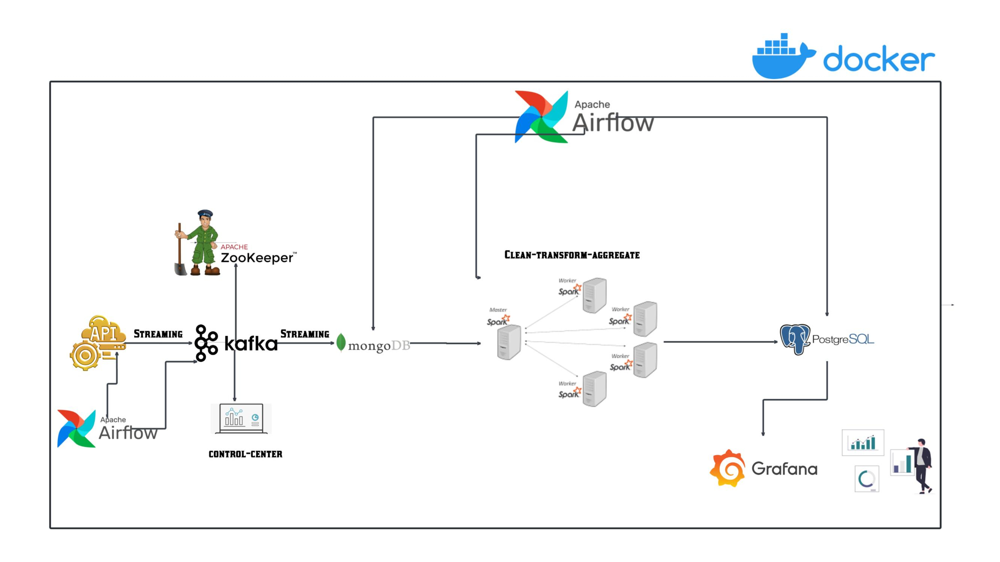

# OpenAQ Data Engineering Project

This project implements a robust pipeline for extracting, processing, and storing air quality data from the [OpenAQ API](https://docs.openaq.org/). It integrates real-time data processing, batch processing, and streaming using technologies like Kafka, Spark, PostgreSQL, and Airflow.

---

## Table of Contents
1. [Overview](#overview)
2. [Architecture](#architecture)
3. [Prerequisites](#prerequisites)
4. [Project Structure](#project-structure)
5. [Getting Started](#getting-started)
6. [Pipeline Workflow](#pipeline-workflow)
7. [Testing and Monitoring](#testing-and-monitoring)
8. [Data Visualization with Grafana](#data-visualization-with-grafana)
9. [Troubleshooting](#troubleshooting)
10. [License](#license)

---

## Overview
The pipeline facilitates:
- **Data Extraction:** Fetching air quality data (parameters, locations, and countries) from the OpenAQ API.
- **Real-Time Streaming:** Processing real-time measurements with Kafka and Spark Streaming.
- **Batch Processing:** Enriching and storing dimension data using Spark.
- **Data Storage:** Persisting processed data in PostgreSQL.
- **Orchestration and Monitoring:** Managing tasks and monitoring pipelines with Airflow.

---

## Architecture

The pipeline is composed of the following steps:
1. **Data Fetching:** Extracts data from the OpenAQ API.
2. **Data Streaming:** Publishes data to Kafka topics.
3. **Data Processing:** Processes and enriches data using Spark.
4. **Data Storage:** Stores processed data in PostgreSQL.
5. **Real-Time Streaming:** Handles continuous measurement updates with Spark Streaming.



---

## Prerequisites

Ensure you have the following installed:
- [Docker](https://www.docker.com/)
- [Docker Compose](https://docs.docker.com/compose/)

---

## Project Structure

```
DataEngProject/ 
├── .dockerignore 
├── docker-compose.yml 
├── README.md 
├── airflow_requirements.txt 
├── dags/ 
│   └── initialize_pipeline_dag.py 
├── img/ 
│   └── Project_architecture.jpeg 
├── kafkaScripts/ 
│   ├── KafkaProducer.py 
│   ├── OpenAQCollector.py 
├── postgres-init/ 
│   ├── airflow-init.sql 
│   └── init.sql 
├── spark/ 
│   ├── spark_process_dim_data.py 
│   ├── spark_stream.py 
└── Grafana_Dash.png 
```

---

## Getting Started

### 1. Clone the Repository

```bash
git clone https://github.com/Mehdi-24-K4/DataEngProject.git
cd DataEngProject
```

### 2. Configure the API Key
Create a file named `api_key.json` in the `dags` directory:

```json
{
  "New_API_KEY": "your_openaq_api_key"
}
```

### 3. Build and Start Services
Run the following command to build and deploy the services:

```bash
docker-compose up -d --build
```

Deployed services:
- Airflow (http://localhost:8086)
- Kafka
- PostgreSQL
- Spark
- Supervisor
- Zookeeper
- Grafana (http://localhost:3000)

---

## Pipeline Workflow

### 1. Batch Processing
- Extracts data from the OpenAQ API using Airflow DAG.
- Processes dimension data (e.g., parameters, stations) with Spark.
- Publishes data to Kafka topics and persists it in PostgreSQL.

### 2. Real-Time Streaming
- Spark Streaming ingests Kafka topics for live measurement data.
- Processes and stores measurements in PostgreSQL in near real-time.

---

## Testing and Monitoring

### Testing the Pipeline
1. **Trigger the Airflow DAG:**
   - Access Airflow at `http://localhost:8086` (default credentials: `airflow/airflow`).
   - Enable and trigger the `initialize_pipeline_dag`.

2. **Validate Kafka Topics:**
   - Use Kafka CLI or a monitoring UI to check topic ingestion.

3. **Check PostgreSQL:**
   - Access the PostgreSQL container:

   ```bash
   docker exec -it postgres psql -U your_user -d openaq
   ```

   - Verify the populated tables (`country`, `parameter`, `location`, `latest_measurements`).

### Logs and Monitoring
- Airflow logs: Accessible via the Airflow UI.
- Spark logs: Found in the `spark/logs` directory.

---

## Data Visualization with Grafana

Grafana provides real-time and historical air quality insights.

### Steps to Configure Grafana

1. **Access Grafana:**
   - Navigate to `http://localhost:3000` (default credentials: `admin/admin`).

2. **Add PostgreSQL Data Source:**
   - Host: `postgres:5432`
   - Database: `openaq`
   - Username: `your_user`
   - Password: `your_password`

3. **Build Dashboards:**
   - Query data and create visualizations (e.g., graphs, tables).


---

## Troubleshooting

### Common Issues
1. **API Rate Limits:**
   - The pipeline includes a dynamic rate limiter to handle OpenAQ API limits.

2. **Kafka Connection Errors:**
   - Verify the Kafka service is running on `kafka:9092`.

3. **Database Connection Issues:**
   - Check PostgreSQL configuration in the environment variables.

---

## License
This project is licensed under the MIT License. See the LICENSE file for details.

---

## Author

*Ouazzani Jamil Mehdi* - [GitHub Profile](https://github.com/Mehdi-24-K4)