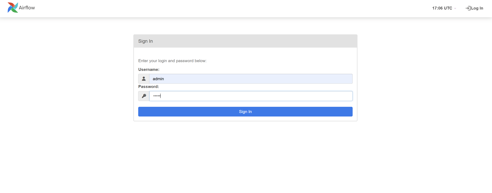

# OpenAQ Data Engineering Project

This project is a robust pipeline for extracting, processing, and storing air quality data from the [OpenAQ API](https://docs.openaq.org/). It integrates real-time data processing, batch processing, and streaming using cutting-edge technologies like Kafka, Spark, PostgreSQL, and Airflow.

## Key Features
1. **Data Extraction**: Fetches air quality data (parameters, locations, and countries) from the OpenAQ API.
2. **Kafka Streaming**: Utilizes Kafka for streaming data between components.
3. **Batch Processing**: Processes dimension data with Apache Spark.
4. **Real-Time Streaming**: Processes real-time measurements using Spark Streaming.
5. **Data Storage**: Stores processed data in PostgreSQL.
6. **Orchestration and Monitoring**: Uses Airflow to manage tasks and monitor pipelines.

---

## Project Architecture

The pipeline consists of the following steps:
1. **Data Fetching**: Extracts data from the OpenAQ API.
2. **Data Streaming**: Publishes the extracted data to Kafka topics.
3. **Data Processing**: Uses Spark to process and enrich the data.
4. **Data Storage**: Writes processed data to PostgreSQL.
5. **Real-Time Streaming**: Uses Spark Streaming for real-time measurements.


---

## Prerequisites

Before running the project, ensure you have:
- [Docker](https://www.docker.com/)
- [Docker Compose](https://docs.docker.com/compose/)

---

## Project Structure
Here is the following project structure:

```
DataEngProject/ 
├── .dockerignore 
├── airflow_requirements.txt 
├── docker-compose.yml 
├── Dockerfile.airflow 
├── Dockerfile.spark 
├── Dockerfile.supervisor 
├── Grafana_Dash.png 
├── init-topics.sh 
├── README.md 
├── requirements.txt 
├── init.py 
├── dags/ 
│ └── initialize_pipeline_dag.py 
├── img/ 
│ └── Project_architecture.jpeg 
├── jars/ 
│ ├── postgresql-42.6.2.jar 
│ └── spark-sql-kafka-0-10_2.12-3.5.4.jar 
├── kafkaScripts/ 
│ ├── KafkaProducer.py 
│ ├── OpenAQCollector.py 
│ └── init.py 
├── postgres-init/ 
│ ├── airflow-init.sql 
│ └── init.sql 
└── spark/ 
  ├── spark_process_dim_data.py 
  ├── spark_stream.py 
  ├── supervisor.py 
  └── init.py
```
---

## Getting Started

### 1. Clone the Repository

```bash
git clone https://github.com/Mehdi-24-K4/DataEngProject.git
cd DataEngProject
```

### 2. Set Up API Key for OpenAQ
Create a file named ```api_key.json``` in the ```dags``` directory to store your OpenAQ API key:
```json
{
  "New_API_KEY": "your_openaq_api_key"
}
```

### 3. Build and Start Docker Services
Run the following command to build and start the services:
```bash
docker-compose up -d --build
```
The following services will be deployed:
- Airflow: For orchestrating the pipeline.
- Kafka: For streaming data between components.
- PostgreSQL: For storing processed data.
- Spark: For processing batch and real-time data.
- Supervisor: For monitoring DAG progress and triggering Spark Streaming.
- Zookeeper
- Grafana

### 4. Access Airflow UI
- Open your browser and go to ```http://localhost:8086```.
- Log in with the default credentials:
  - Username: ```airflow```
  - Password: ```airflow```.

    
  
- Enable and trigger the DAG named ```initialize_pipeline_dag```.
- Monitor the progress of each task in the Airflow UI.


### 5. Monitor Spark Streaming
Once the DAG completes processing the dimensions, the Supervisor container detects when the last task begins and automatically triggers the Spark Streaming job. This job processes real-time measurements from Kafka and stores them in PostgreSQL.


### 6. Kafka Topics
- Use Kafka CLI.
- Acess the control center UI by opening  your browser and going to http://localhost:8086:


- Check data ingestion into topics.


### 7. PostgreSQL
- Connect to the database to validate data storage by:
```bash
docker exec -it postgres psql -U your_user -d openaq
```
- Or by using the postgreSQL container's bash use:
```bash
psql -U your_user -d openaq
```
The database consists of:
- ```country```: Stores country dimension data.
- ```parameter```: Stores parameter dimension data.
- ```location```: Stores location dimension data.
- ```latest_measurements```: Stores real-time measurement data.


### 8. Grafana
Grafana is used to visualize the data stored in PostgreSQL from the pipeline. It provides an intuitive interface to explore real-time air quality data and historical records.

#### Key Features
- *Data Visualization*: Create interactive dashboards to explore dimensions like parameters, locations, and country statistics.
- *Real-Time Insights*: Monitor real-time air quality data ingested and stored in PostgreSQL.
- *Custom Dashboards*: Build customized visualizations tailored to your data needs.

#### Access Grafana
##### 1. *Open the Grafana UI*:
  - In your browser, navigate to: http://localhost:3000.

    

##### 2. *Log in to Grafana*:
  - Default credentials:
    - Username: admin
    - Password: admin.
  - You can change the credentials after logging in for the first time.
##### 3. *Configure PostgreSQL as a Data Source*:
  - Go to the *Configuration* tab and select *Data Sources*.
  - Click *Add Data Source* and select *PostgreSQL*.

    

  - Enter the following details:
    - *Host*: ```postgres:5432```
    - *Database*: ```openaq```
    - *Username*: ```your_user```
    - *Password*: ```your_password```
  - Make sure to select the `*disable* option in the ```TLS/SSL Mode```.
    
    
  
  - Save and test the connection to ensure it's successful.
##### 4. *Create Dashboards*:
  - Use the PostgreSQL data source to query and visualize data.
  - Customize panels to represent your data using graphs, tables, and heatmaps. 


### 9. Logs and Monitoring
- Logs for each container are stored in the ```/logs/``` directory within the containers.
- Use Airflow to monitor task progress and job status.
- Spark logs are available in the ```spark/logs``` directory.
- Spark streaming logs are available in the spark-supervisor container.

## 🛠 How It Works

### 1. Batch Processing (Airflow DAG)
- **Step 1**: Extract data from the OpenAQ API using the ```initialize_pipeline_dag.py```.
- **Step 2**: Process the data with Spark and store it in PostgreSQL via temporary tables.
- **Step 3**: Kafka topics are used as intermediaries for dimension data (parameters, stations, country).
### 2. Real-Time Processing (Spark Streaming)
- **Step 1**: Supervisor container detects the final task in the DAG.
- **Step 2**: Triggers Spark Streaming (```spark_stream.py```) to process the latest measurement data.
- **Step 3**: Data is stored in PostgreSQL in near real-time.

## Troubleshooting
### Common Issues
#### 1. API Rate Limits:
  - The OpenAQ API enforces rate limits. The pipeline dynamically handles these limits using an asynchronous rate limiter.

#### 2. Kafka Connection:
  - Ensure that the ```kafka``` service is running and accessible on ```kafka:9092```.
#### 3. Database Connection:
  - Verify PostgreSQL connection parameters in the environment variables or configuration files.

## License
This project is licensed under the MIT License. See the LICENSE file for details.

## Auteur

*Ouazzani Jamil Mehdi* - [Votre profil GitHub](https://github.com/Mehdi-24-K4)

This README provides all the necessary information while being concise and professional. Let me know if you'd like further refinements!